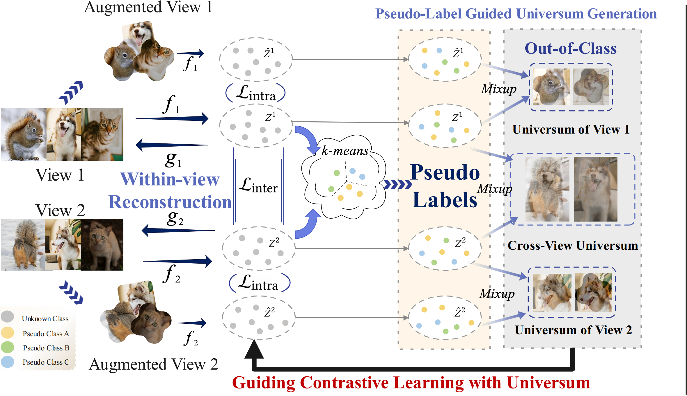
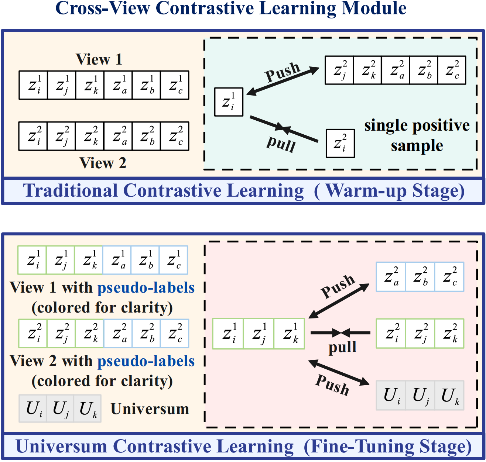

# 🧸 Pseudo Label Guided Universum Learning for Robust Multi-view Clustering

This repository provides the PyTorch implementation of **PAUSE**, proposed in the paper *Robust Multi-view Clustering via Pseudo Label Guided Universum Learning*.

<div style="display: flex; gap: 10px; align-items: center;">
  
  
</div>


## 🍭 Requirements

### 🧩 Environment

The code depends on `pytorch`, `scikit-learn`, `scipy`, and `munkres`.  
You can set up your environment with the following commands:

```bash
python=3.11
pytorch==2.2.2
pytorch-cuda=11.8
scikit-learn==1.3.0
scipy==1.12.0
munkres==1.1.4
```

## 🎯 Running

Run the following command to start training:

```bash
python main_train.py
```

## 🎀 Acknowledgement

This implementation is based on [Candy](https://github.com/XLearning-SCU/2024-NeurIPS-CANDY).
